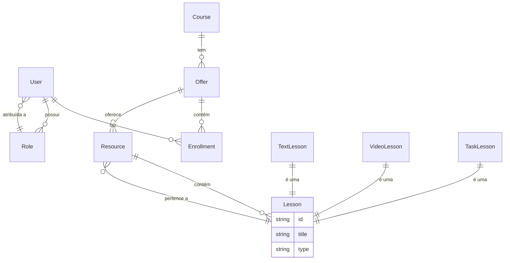

# DSLearn - Plataforma de Ensino Online (Backend)
[](https://github.com/Jacques-Trevia/dslearn/blob/main/LICENSE)

[](https://openjdk.org/projects/jdk/17/)
[](https://spring.io/projects/spring-boot)
[](https://opensource.org/licenses/MIT)

## 📖 Sobre o Projeto

O **DSLearn** é um projeto backend desenvolvido durante o curso **Java Spring Professional** da DevSuperior. Ele simula a API de uma plataforma de ensino online, onde é possível gerenciar usuários, cursos, ofertas, recursos e lições. O objetivo principal é aplicar conceitos avançados de Spring Framework, modelagem de domínio, segurança, banco de dados relacional e boas práticas de desenvolvimento.

## ✨ Principais Funcionalidades

*   **Gestão de Usuários e Roles**: Controle de acesso baseado em perfis (ADMIN, INSTRUTOR, ESTUDANTE).
*   **Estrutura de Cursos**: Cursos que contêm ofertas, que por sua vez contêm recursos e lições.
*   **Controle de Conteúdo**: Diferenciação entre lições de texto, vídeo e tarefas.
*   **Progresso do Aluno**: Acompanhamento do progresso dos estudantes nas lições e cursos.
*   **API RESTful**: Endpoints bem definidos para integração com um front-end (como um aplicativo mobile ou SPA).

## 🚀 Tecnologias Utilizadas

*   **Java 17**: Linguagem de programação.
*   **Spring Boot**: Framework principal para criação da API.
*   **Spring Security**: Autenticação e autorização (OAuth2, JWT).
*   **Spring Data JPA**: Mapeamento objeto-relacional e acesso a dados.
*   **Hibernate**: Implementação do JPA.
*   **PostgreSQL**: Banco de dados relacional utilizado em produção.
*   **H2 Database**: Banco de dados em memória para testes e desenvolvimento.
*   **Maven**: Gerenciador de dependências e build.
*   **JUnit 5 & Mockito**: Testes unitários e de integração.

## 🗺️ Modelo de Domínio

O projeto segue uma modelagem de domínio rica e bem estruturada. Abaixo está a representação simplificada das principais entidades e seus relacionamentos:



*   **User**: Representa um usuário do sistema (estudante, instrutor, admin).
*   **Role**: Define os perfis de acesso.
*   **Course**: Um curso disponível na plataforma.
*   **Offer**: Uma oferta específica de um curso (com datas de início, fim, etc.).
*   **Enrollment**: Matrícula de um usuário em uma oferta de curso, incluindo o progresso.
*   **Resource**: Recursos auxiliares de um curso (como uma comunidade do Discord, material de apoio).
*   **Lesson**: As lições que compõem um recurso. Possui subtipos: texto, vídeo e tarefa.

## ▶️ Como Executar o Projeto

### Pré-requisitos
*   JDK 17 ou superior instalado.
*   Maven (ou utilize o wrapper `./mvnw` incluído no projeto).
*   PostgreSQL instalado e configurado (ou outro banco de dados de sua preferência).

### Passos

1.  **Clone o repositório**:
    ```bash
    git clone https://github.com/Jacques-Trevia/dslearn.git
Acesse a pasta do projeto:

bash
cd dslearn
Configure o banco de dados:

Crie um banco de dados no PostgreSQL (ex: dslearn).

Renomeie o arquivo application.properties na pasta src/main/resources para application-local.properties (ou edite o existente).

Adicione as configurações do seu banco de dados:

properties
```
spring.datasource.url=jdbc:postgresql://localhost:5432/dslearn
spring.datasource.username=seu_usuario
spring.datasource.password=sua_senha
spring.jpa.hibernate.ddl-auto=update
spring.jpa.properties.hibernate.jdbc.lob.non_contextual_creation=true
```
Execute o projeto:

bash
./mvnw spring-boot:run
A API estará disponível em http://localhost:8080.

🧪 Testando a API
A API pode ser testada utilizando ferramentas como Postman ou Insomnia. A autenticação é baseada em OAuth2 com JWT.

Endpoint de autenticação (geralmente no path /oauth/token).

Para acessar endpoints protegidos, inclua o token JWT no cabeçalho Authorization: Bearer <seu_token>.

(Sugestão: se você documentou os endpoints com Swagger, pode incluir o link aqui.)

📁 Estrutura do Projeto
A estrutura segue os padrões do Spring Boot, organizando as camadas de domínio, repositório, serviço e controle.

```
src/
└── main/
    ├── java/com/jacques/dslearn/
    │   ├── config/          # Configurações (Security, Beans, etc.)
    │   ├── controllers/     # Endpoints REST
    │   ├── dto/             # Objetos de transferência de dados
    │   ├── entities/        # Classes de domínio (JPA)
    │   ├── repositories/    # Interfaces de acesso a dados
    │   ├── services/        # Lógica de negócio
    │   └── resources/       # Arquivos de configuração
    └── resources/
        ├── application.properties
        └── import.sql       # Dados de teste (se existente)
```

---

## 📜 Licença

Este projeto é parte do curso da **DevSuperior** e tem propósito educacional.

---

## 👨‍💻 Autor

**Jacques Araujo Trevia Filho**

[](https://www.linkedin.com/in/jacques-trevia)
[](https://github.com/Jacques-Trevia)
